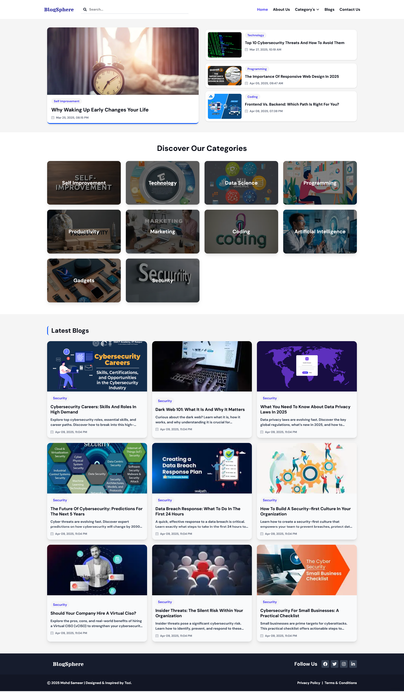
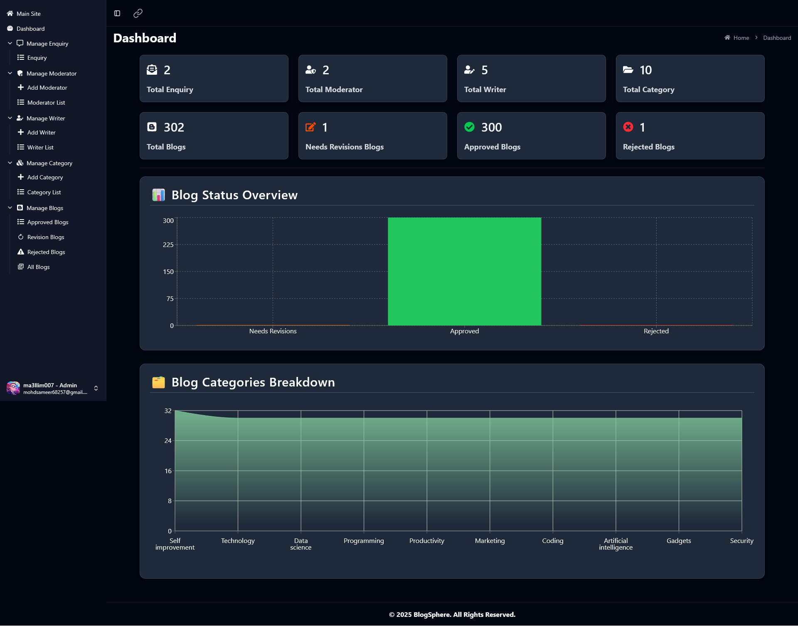
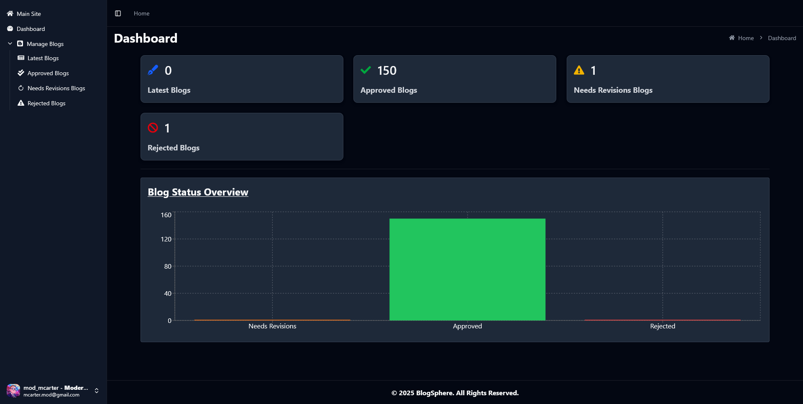
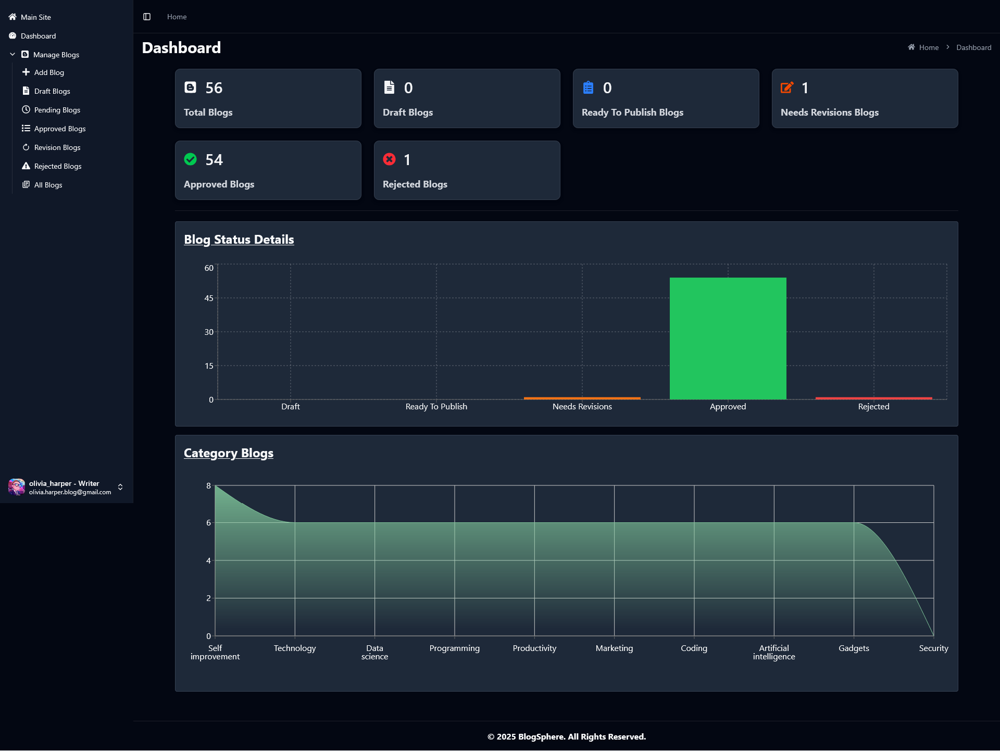

# **BlogSphere – Multi-Role Blogging Platform**



## **Overview**

**[BlogSphere](https://blogspherree.netlify.app/)** is a comprehensive full-stack blogging platform built with React and Node.js that enables seamless collaboration between writers, moderators, and administrators. It provides a clean and intuitive frontend experience for users, alongside powerful admin tools for content moderation, role management, and category organization. With an emphasis on content quality and community engagement, **[BlogSphere](https://blogspherree.netlify.app/)** is perfect for teams and organizations managing dynamic content.

## **Features**

-   Public-facing pages: Home, About Us, Blogs, Blog Details, Category-wise listing, Contact Us
-   Enquiry system via contact form
-   User roles: Admin, Moderator, Writer
-   Admin-controlled role assignment and verification
-   Blog lifecycle: draft, review, revision, publish
-   Moderation workflow with approval and feedback system
-   Dynamic category management
-   Fully responsive UI/UX

## **Technologies Used**

-   **Frontend:** React.js with Redux & Redux Persist
-   **Styling:** TailwindCSS and ShadCN UI
-   **Routing:** React Router DOM
-   **Backend:** Node.js with Express.js
-   **Database:** MongoDB with Mongoose
-   **Authentication:** JWT-based role authentication
-   **State Management:** Redux Toolkit
-   **Hosting & Deployment:** Render And Netlify.

<br>

# **🛠️ Admin Panel**


The Admin Panel offers complete oversight and control over the blogging platform. Admins can manage content, users, and platform structure efficiently.

### **🔍 Enquiries**

-   View and manage all submissions from the Contact Us form
-   Track and respond to user inquiries

### **👤 Moderator Management**

-   Add new moderators to assist with content approval
-   View a full list of all registered moderators
-   View individual moderator profiles
-   Verify moderators before granting them access to the moderation panel

### **✍️ Writer Management**

-   Add new writers who contribute blog content
-   List and monitor all registered writers
-   View individual writer details
-   Verify writers to allow publishing access

### **🗂 Category Management**

-   Create new blog categories to organize content
-   List all categories with management options
-   Delete categories that are no longer needed

### 📚 Blog Management

-   View all blog submissions across the platform
-   Monitor blog statuses: Pending, Approved, Rejected, Needs Revision
-   Access detailed views of each blog submitted by writers
-   Maintain content quality and platform standards

<br>

# **🛡️ Moderator Panel**


Moderators are responsible for ensuring the quality and compliance of all blog content submitted by writers. They play a critical role in content governance and editorial review.

### **📋 Latest Blogs**

-   View all latest blog submissions by writers.

### **👁️ View Blogs**

-   Access complete blog details.
-   Read the full content and check for policy compliance or quality guidelines.

### **✅ Approve Blogs**

-   Approve blogs that meet the platform’s standards.
-   Automatically move approved blogs to the public listing.

### **✍️ Request Revisions**

-   If improvements are needed, flag the blog for "Need Revision".
-   Provide clear, constructive feedback to guide writers.

### ❌ **Reject Blogs**

-   Reject inappropriate or low-quality content.
-   Add reason for rejection to maintain transparency with writers.

<br>

# ✍️ Writer Panel


Writers are the content creators of the platform. They have access to tools to manage their blog submissions, track approval status, and make revisions when required.

### **📝 Add New Blog**

-   Create blog posts with a title, description, body content, and category.
-   Save blogs as Drafts or Submit for Review to Moderators.

### **🗂️ Blog Status Management**

-   Draft Blogs: Unpublished blogs saved for later editing.
-   Pending Blogs: Submitted blogs awaiting review from moderators.
-   Approved Blogs: Blogs that have been reviewed and approved for publication.
-   Revision Blogs: Blogs that moderators have requested edits for before approval.
-   Rejected Blogs: Blogs that did not meet approval standards.
-   All Blogs: Access to all of the writer’s blogs, regardless of status.

### **✏️ Edit Blogs**

-   Edit draft blogs or blogs returned for revision.

### **📄 View Blogs**

-   View blog details including status, feedback from moderators, and publish info.

### **❌ Delete Blog**

-   Delete personal blogs (only drafts or rejected ones) before they are approved.

## Installation

To set up the project locally, follow these steps:

### Frontend Setup

1. Navigate to the `frontend` directory:

    ```bash
    cd frontend
    ```

2. Install dependencies:

    ```bash
    yarn
    ```

3. Set up environment variables:

    ```bash
    cp .env.sample .env
    ```

    Update `.env` file with your credentials (e.g., Backend URL,etc.).

4. Start the frontend server:
    ```bash
    yarn start
    ```
    The frontend should be accessible at `http://localhost:5173`.

---

### Backend Setup

1. Navigate to the `backend` directory:
    ```bash
    cd ../backend
    ```
2. Install dependencies:
    ```bash
    yarn
    ```
3. Set up environment variables:

    ```bash
    cp .env.sample .env
    ```

    Update `.env` file with your credentials (e.g., database URI, Stripe keys, JWT secret, etc.).

4. Start the backend backend:
    ```bash
    npm run dev
    ```
    The backend should be accessible at `http://localhost:8000`.

## 🧑‍💻 Usage

### **🔎 Explore Content:**

-   Visit the Home page to discover the latest blogs and explore various categories.

### **🗂️ Browse by Category:**

-   Navigate through the Categories section to find blogs grouped by specific interests or topics.

### **📖 Read Blogs:**

-   Access detailed blog content from the Blogs or Blog Details pages.

### **✉️ Get in Touch:**

-   Submit your queries or feedback using the Contact Us form.

### **✍️ Writer Access:**

Verified writers can:

-   Create new blog drafts
-   Manage blogs in various states: Draft, Pending, Approved, Revision Needed, Rejected
-   Edit and view their own blogs

### **🧑‍⚖️ Moderator Review:**

Moderators have the ability to:

-   View all submitted blogs
-   Approve, reject, or request revisions
-   Maintain quality control before publishing

### **🛠️ Admin Control:**

Admins manage:

-   Users (Moderators & Writers)
-   Blog content and categories
-   Platform-wide settings and contact inquiries

## Development & Contribution

### Steps to Contribute

1. Clone the repository:
    ```bash
    git clone https://github.com/ma3llim007/blogsphere.git
    ```
2. Create a new branch:
    ```bash
    git checkout -b feature/your-feature-name
    ```
3. Implement your changes and commit:
    ```bash
    git add .
    git commit -m "Describe your changes here"
    ```
4. Push to GitHub:
    ```bash
    git push origin feature/your-feature-name
    ```
5. Open a pull request on GitHub and describe your changes.

## **Contribution Guidelines**

-   Follow existing project architecture
-   Use descriptive commit messages
-   Ensure all new features are fully tested
-   Submit detailed Pull Requests
-   Use GitHub Issues to report bugs or suggest features

## License

This project is licensed under the MIT License - see the [LICENSE](LICENSE) file for details.

## Acknowledgements

-   **React & Redux:** For powerful UI and state management
-   **TailwindCSS & ShadCN:** For beautiful and scalable design
-   **Node.js & Express:** Fast and flexible backend
-   **MongoDB:** For handling blog content and user roles
-   **JWT:** Secure authentication and session handling
